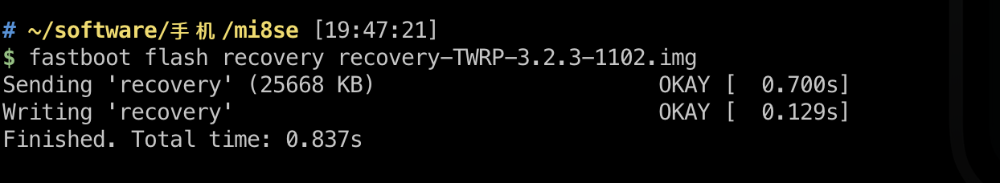

# Mi8-SE-Flash-Global-Rom(小米8SE刷国际版系统)


小米8SE并未在全球上市，所以通常意义上的国际版(https://c.mi.com/) 是没有mi8 se的rom的，不过我们依然可以刷入更纯净的欧洲版miui(https://xiaomi.eu/) ，所以以下语境中的国际版都是指的EU版本

**小米8SE不能直接刷国际版系统，需要先刷低版本的国行miui底包，再刷同大系列的EU版本miui，再从低版本的EU版升级刷入EU版的miui 12**

## 步骤
1. 备份你的数据！ 备份你的数据！！ 备份你的数据！！！
2. 小米8 SE需要解bl锁，这个可以去搜索，不赘述
3. 需要准备下载如下文件，最好放在一个目录下，方便下文叙述
    - [mi flash工具](https://www.xiaomiflash.com/)，小米官方的线刷工具，也可以用国内版的，我用着没差别，不过只有windows版的，我是mac装着虚拟机使用，也没问题
    - [adb工具](https://developer.android.com/studio/releases/platform-tools)，根据平台自行安装
    - [China 8.12.13 developer fastboot版rom](https://xiaomifirmware.com/download/11308/)
    - [EU 8.12.27 developer rom](https://sourceforge.net/projects/xiaomi-eu-multilang-miui-roms/files/xiaomi.eu/MIUI-WEEKLY-RELEASES/8.12.27/xiaomi.eu_multi_MI8SE_8.12.27_v10-9.zip/download)
    - [mi8 se定制版的twrp](./recovery-TWRP-3.2.3-1102.img)
    - [twrp 1127](./twrp-1227.img) 用来覆盖安装recovery
    - [EU版的miui 12](https://sourceforge.net/projects/xiaomi-eu-multilang-miui-roms/files/xiaomi.eu/MIUI-STABLE-RELEASES/MIUIv12/xiaomi.eu_multi_MI8SE_V12.0.2.0.QEBCNXM_v12-10.zip/download)，这个是当下节点最新的miui 12，需要其他版本的可以去 https://xiaomi.eu/ 自行寻找
    - 手机进入fastboot模式的方法为：音量下键+电源键，重启手机，下文会使用
  
4. 刷入cn rom的底包：重启手机进入fastboot模式，数据线连接电脑，使用mi flash线刷入 `China 8.12.13 developer fastboot`版rom，重启手机并正常进入系统
5. 刷入TWRP的recovery：重启手机进入fastboot模式，用数据线连接电脑，打开你的Terminal（windows就是cmd或者powershell）,执行如下命令
  ```sh
  fastboot flash recovery recovery-TWRP-3.2.3-1102.img
  ```
  得到如图结果 

  然后执行，进入recovery
  ```sh
  fastboot boot recovery-TWRP-3.2.3-1102.img
  ```

6. 进入twrp后，连接手机，将`EU 8.12.27 developer rom` 复制到手机内置存储，选择recovery的安装(install)，点选你复制进去的rom文件，滑动按钮确认刷入，注意不要勾选`安装完成后自动重启进入系统`！刷入完成后进入下一步
7. 返回twrp主界面，选择清除(wipe) - 高级清除选项 - Data - 滑动确认，刷入完成后进入下一步
8. 返回twrp主界面，先将`twrp 1127` 复制到手机中，选择安装(install) - 刷入image镜像 - 点选 `twrp 1127` - 选择类型为Recovery - 滑动刷入，刷入完成后进入下一步
9. 返回twrp主界面，选择重启 - Recovery，重启后会再次进入twrp
10. twrp主界面 - 选择清除 - 格式化data分区 - 输入yes确认，格式化后，进入下一步
11. 选择重启 - Recovery，再次重启进入twrp
12. twrp主界面 - 选择重启 - 重启系统，此时你已经可以进入 `EU 8.12.27 developer` 的miui啦
13. 音量上键+电源键，重启进入twrp，复制 `EU版的miui 12`到系统内置存储，选择安装， 点选你复制进去的rom文件，滑动按钮确认刷入，注意不要勾选`安装完成后自动重启进入系统`！刷入完成后进入下一步
14. 重复上述步骤中的7(清除data)、10(格式化data)、11(重启Recovery)、12(重启进入miui)
15. Enjoy your global miui 12（享受你的国际版miui 12吧）。


## 参考引用
 - https://youtube.com/watch?v=v4Pl9iY3u3w
 - https://www.zhihu.com/question/50231539
